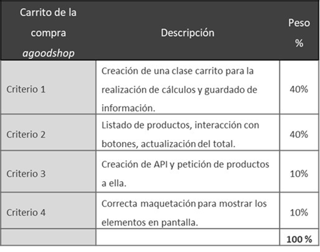

**Actividad 1: carrito de la compra agoodshop. Realizada por Abraham Cantalejo Guerrero, alumno de 2ºDAW, UNIR FP**

**Objetivos de la actividad**

En esta actividad debes programar la funcionalidad de carrito de la compra de una tienda online ficticia. Aquí pondrás en práctica:
▸	Llamadas a una API.  
▸	Manejo y modificación del DOM.  
▸	Programación orientada a objetos.

Se ha trabajado sobre una base que el profesor compartió, porque aún no se han visto en clase algunos conceptos avanzados de JavaScript solicitados en la tarea. A partir de esa base se ha completado la implementación práctica de la lógica del carrito y su integración con el DOM.

**Pautas de elaboración**

El corazón del carrito de la compra debe ser una clase carrito que es la que se encargue de guardar la información y hacer los cálculos. Te recomiendo que empieces por ahí y, una vez la tengas lista, empieces a maquetar y conectarte a la API. La clase carrito no debe conocer nada acerca del documento HTML ni interactuar con el DOM, simplemente sabe hacer cálculos.

Los productos vendrán de una API. Puedes elaborar tú mismo una gracias a la página https://jsonblob.com/, pegando un JSON, guardándolo y pudiéndolo consultar posteriormente como si fuese una API https://jsonblob.com/api

En este proyecto concreto:
- El profesor proporcionó la base inicial del carrito (clases y estructura) para poder avanzar aunque algunos conceptos aún no se hayan impartido en clase.
- Se creó un endpoint mock para los productos usando Mocki.io (la alternativa escogida porque la API de JSONblob no funcionó correctamente en este caso). El código del proyecto consume ese JSON remoto para poblar la lista de productos.
- La clase Carrito se mantiene separada de la manipulación del DOM: realiza los cálculos y gestiona los ítems; el script de la interfaz se encarga de actualizar la vista.

**Mejoras visuales y CSS**

Se han añadido elementos de Bootstrap para mejorar la apariencia (grid, cards, table-responsive, list-group, badges y botones). Además, se aplicaron pequeñas modificaciones CSS fuera de Bootstrap cuando fue necesario para ajustar elementos que están ligados al script (por ejemplo, scroll en el listado del carrito y ajustes de posición/fijación). Estas ediciones CSS son mínimas y están pensadas para no interferir con el comportamiento del script ni con las clases de Bootstrap.

**Implementación y API**

- Endpoint de datos: se utilizó Mocki.io para alojar el JSON con los artículos. El script carga ese JSON al inicio para generar dinámicamente la tabla de productos.
- Motivo: JSONblob presentó problemas en las pruebas, por eso se optó por Mocki.io como servicio de mock stable.

**Artículos y funcionalidad**

- Se han cambiado algunos artículos proporcionados inicialmente y se han añadido varios más. Todos los artículos son totalmente funcionales con el carrito: pueden sumarse, restarse, calcular subtotales y actualizar el total final.
- Mantengo los identificadores y estructuras necesarias para que el script original funcione sin romper la lógica proporcionada en la base del profesor.

**Extensión y formato**

Se debe entregar una carpeta de proyecto comprimido, en ella un archivo index.html y el resto de los archivos que consideres necesarios.

Además, se debe de entregar el enlace al repositorio público de github del proyecto.

**Criterios de evaluación**

Especifica los criterios con los que medir los resultados obtenidos por el estudiante con la herramienta de la rúbrica.

